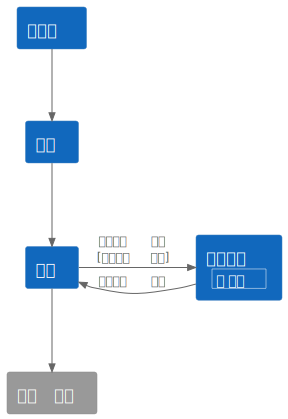

# Console Sokoban 기술문서

콘솔 환경에서 객체지향 이념을 적용해 소코반류 퍼즐 게임을 제작

## 개발 환경

* 개발 기간: 4일
* 개발 인원: 1명([최지성](https://github.com/rhtmxm17))
* 사용 툴: VisualStudio, GitHub

## 게임 개요

타일로 구성된 스테이지에서 방향키로 플레이어 캐릭터를 조작해 공 개체를 골에 밀어넣는 게임이다.

## 구현사항

### 씬 시스템

장면의 구분과 전환, 그리고 장면에 대한 조작을 씬 클래스에 일임한다.

* 클래스 구조

  * 추상 클래스 `Scene`을 상속하는 형태로 구현한다.
  * 장면은 분명 공통적인 인터페이스를 가지고 있어야 하지만, 그 구현이 제각기 큰 차이가 있기 때문.

* 인터페이스

  * 모든 장면에서 구현해야 하는 `Enter`, `Exit`, `Update`, `Render를` 인터페이스로 둔다.
  * 매 갱신시 `Update` 호출 후 `Render` 출력으로 화면을 갱신할 수 있도록 함.
  * 장면 전환시 기존 장면의 `Exit`과 신규 장면의 `Enter`를 호출하도록 함.

* 키 입력

  * 장면에 대한 키 입력을 확인해 `OnKeyInput` 이벤트를 발생시킨다.
  * 키 입력 자체에 대한 처리는 `Scene` 클래스에 일임하고 자식 클래스를 포함한 타 클래스에서는 이벤트 구독만으로도 키 입력을 확인 가능하도록 함.

* 씬 생성

  * 팩토리 메서드 패턴을 적용함.
  * 관리된 형태의 씬 생성을 의도했다. 씬은 다형적으로 동작하기 때문에 상속된 인스턴스를 `Scene` 타입으로 다루기 적합하기 때문.
  * 스테이지 씬과 같이 하나의 클래스로 구현하는게 적합하지만 스테이지 데이터 설정에 따라 내용이 달라지는 씬의 생성에도 유용했다.

### 게임 로직: 타일 속성

특수 타일을 타일에 속성을 부여하는 형태로 구현했다. 타일 기반 게임 플레이 경험상 특수 타일은 하나의 타일에 여러가지 내용이 중첩되는 경우가 발생하기도 하며, 또한 그렇게 하는것이 스테이지의 다양성을 확보하기 유리하기 때문이다.

* 타일 속성과 이벤트 시스템

  * 일반적으로 특수 타일에서 기능이 발생하는 시점인 '진입'과 '탈출'에 이벤트를 지정(`OnEntry`, `OnAway`)했다.
  * `TileAttribute` 추상 클래스는 `SetAttribute(Tile)`, `RemoveFrom(Tile)` 인터페이스를 둬서 구현한 타일 속성이 필요한 이벤트를 할당할 수 있도록 했다.
  * 이로써 게임 로직상 필요해진다면 하나의 타일을 밟았을 때 여러가지 속성을 트리거할 수 있도록 했다.

### 출력 시스템

* 인터페이스 `IConsoleRender`

  * 좌표, 출력할 문자열, 색상 프로퍼티를 구현할 것을 지정하는 인터페이스.
  * 스테이지 내의 타일, 물체, UI는 모두 해당 인터페이스를 구현하게 해서 출력의 책임을 한 곳에 몰아넣을 수 있게 했다.
  * 확장 메서드를 통해 기본 출력 함수를 구현했다.

* 인터페이스 `IRenderGroup`

  * 묶음의 기본 좌표와 출력할 `IConsoleRender` 객체 묶음을 구현할 것을 지정하는 인터페이스.
  * 객체 묶음은 `IEnumerable`타입을 요구하는 것으로 실제 구현시 필요에 따라 서로 다른 컬렉션을 사용 가능하도록 했다.
  * 확장 메서드를 통해 모든 내용물을 출력하는 함수를 구현했다.

### 게임 데이터 관리

* 환경 설정

  * 게임 시작 시점에 환경설정 씬을 두어서 콘솔 출력에 사용할 예정인 특수문자가 정상적으로 출력되는지 사용자에게 물어본다.
  * 사용자의 선택에 따라 물체의 출력에 사용할 문자를 저장한 공간에 특수문자를 넣거나 보편적인 문자를 넣는다.

* 스테이지 읽어오기

  * 엑셀 등으로 저장한 CSV 파일로부터 스테이지 데이터를 읽어오도록 만들었다.
  * 스테이지 제작을 프로그래밍과 독립적으로 할 수 있도록 하기 위함이다.
